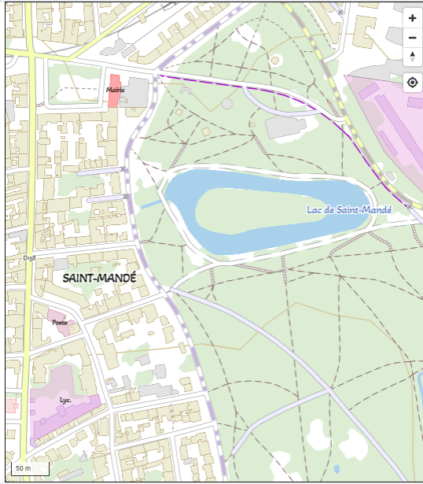

# Test

Test :

* une font generée par l'utilitaire **genfontgl**
(cf. Akaya Telivigala Regular)

* un fichier de style avec l'url local du **glyphs**
(cf. plan-ign-akaya.json)

* une visualisation avec la libraire **maplibre-gl**


L'exemple est dans le répertoire `test`

Pour executer l'exemple :

```sh
$> npm install
$> node server.js
Server started at http://localhost:9001
```


